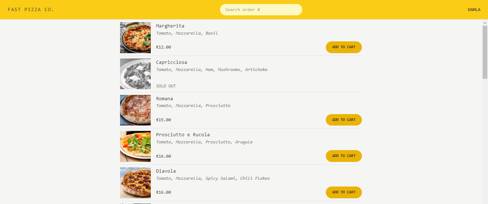
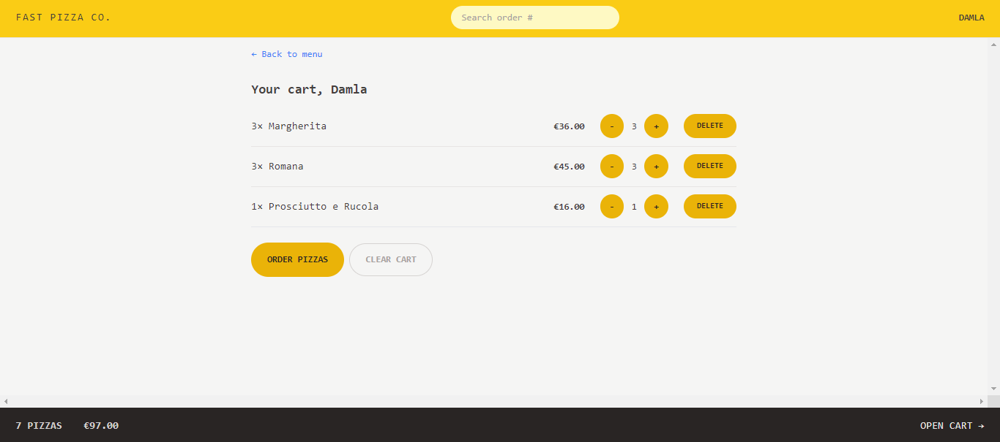
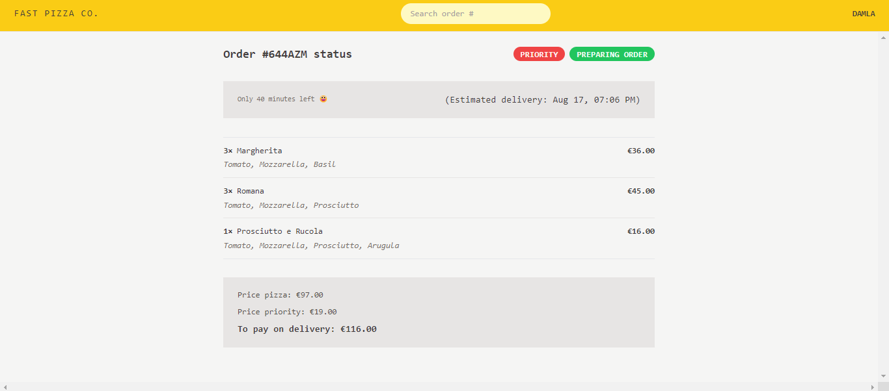

# Fast Pizza Co. 

An application where you can make order pizzas.

## Table of contents

- [Overview](#overview)
  - [The app](#the-app)
  - [Screenshot](#screenshot)
  - [Built with](#built-with)
  - [Used Features](#used-features)
- [Author](#author)

## Overview

### The app

Users should be able to:

- View the optimal layout depending on their device's screen size
- Initially, they can see a welcome page.
- They can log in with their name
- They can see a menu examine the menu with pizzas and add them to their shopping cards.
- They can decrease, increase and delete pizzas from the menu; according to it, they can see the overview below.
- They can see detailed overviews of their shopping from the shopping cart and make the same actions from there.
- They can enter relevant information to complete the purchase. They can automatically fill in the address part with location access.
- They can see information page about their order

### Screenshot

### Built with

- React.JS
- Redux Toolkit
- Tailwind CSS
- ESLint
- Vite
- Geolocation

### Used Features
- useState
- useEffect
- useSelector
- useDispatch
- createSlice
- configureStore
- createAsyncThunk
- useLoaderData
- useFetcher
- REST API

## Author

- LinkedIn - [Damla Kara](https://www.linkedin.com/in/damla-kara-348081232/)